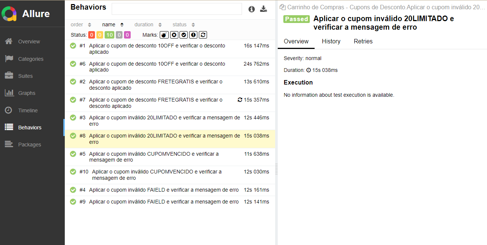
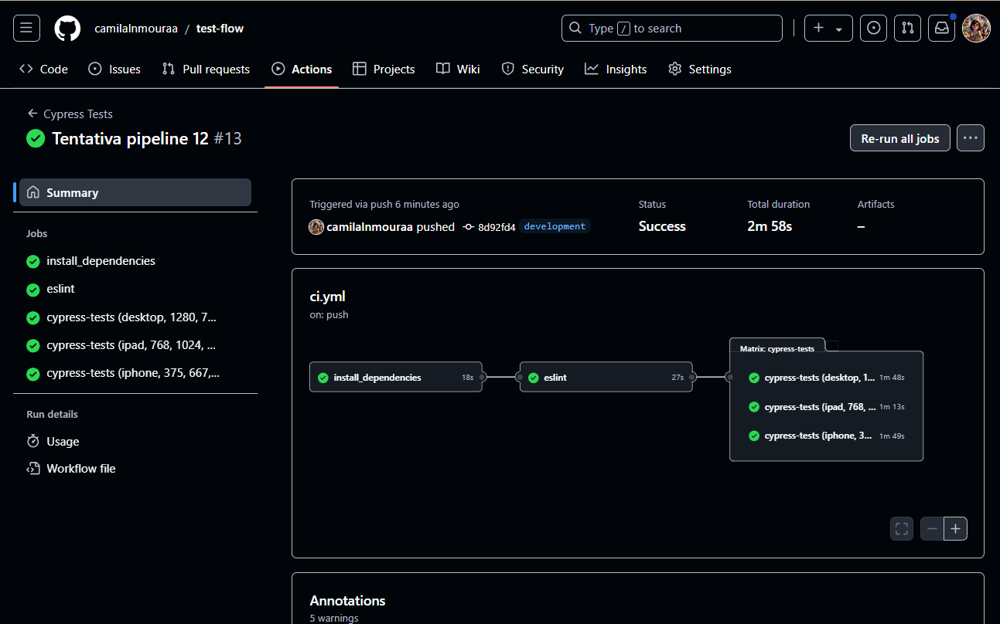

# Carrinho de Compras com Cupons de Desconto

Projeto de automação para a funcionalidade de [`aplicação de cupons de desconto`](cypress/e2e/cupom-desconto.cy.js) no carrinho de compras, que:

- Aceita um cupom válido de desconto como entrada.
- Calcula o valor total da compra aplicando o desconto correspondente.
- Retorna o valor atualizado da compra e valida o cálculo para diferentes tipos de cupons.

> **Note:** A funcionalidade de cupons de desconto permite aplicar benefícios aos clientes durante o processo de compra, especialmente em datas comerciais de grande volume, como a Black Friday.

## Pré-requisitos

Para clonar e executar este projeto, você precisará de:

- [git](https://git-scm.com/downloads) (usei a versão `2.45.2` ao escrever este documento)
- [Node.js](https://nodejs.org/en/) (usei a versão `v20.14.0` ao escrever este documento)
- npm (usei a versão `10.7.0` ao escrever este documento)

**Observação:** Ao instalar o Node.js, o npm é instalado automaticamente. 🚀

## Instalação

Para instalar as dependências de desenvolvimento, execute `npm install` (ou `npm i` para abreviar.)

## Configurando as variáveis ​​de ambiente

Antes de executar os testes, a variável ​​de ambiente precisa ser configurada.

Faça uma cópia do arquivo [`cypress.env.example.json`](./cypress.env.example.json) como `cypress.env.json` e defina o valor da variável.

**Observação:** O arquivo `cypress.env.json` não é rastreado pelo git, pois está listado no arquivo `.gitignore`.

## Executando os testes

Neste projeto, você pode executar testes nos modos interativo e headless, tanto em viewports de desktop quanto de iphone.

### Modo headless

Execute `npm test` (ou `npm t` para abreviar) para executar todos os testes no modo headless usando uma viewport de desktop.

Execute `npm run test:tablet` para executar os testes apropriados no modo headless usando uma viewport de iphone.

### Modo interativo

Execute `npm run cy:open` para abrir o **Cypress App** para executar testes no modo interativo usando uma viewport de desktop.

Execute `npm run cy:open:tablet` para abrir o **Cypress App** para executar testes no modo interativo usando uma viewport de tablet.

> Após rodar os testes, o resultado esperado deve ser semelhante a este:


```sh

  Carrinho de Compras - Cupons de Desconto

    √ Aplicar o cupom de desconto 10OFF e verificar o desconto aplicado (18584ms)
    √ Aplicar o cupom de desconto FRETEGRATIS e verificar o desconto aplicado (14675ms)
    √ Aplicar o cupom inválido 20LIMITADO e verificar a mensagem de erro (11185ms)
    √ Aplicar o cupom inválido FAIELD e verificar a mensagem de erro (12390ms)
    √ Aplicar o cupom inválido CUPOMVENCIDO e verificar a mensagem de erro (13059ms)


  5 passing (1m)

```

## Relatório de Testes Automatizados





## Pipeline de Testes Automatizados




___

This project was created with 🤍 and ☕ by Camila Moura. by [Camila Moura](https://linkedin.com/in/camilalnmoura).
